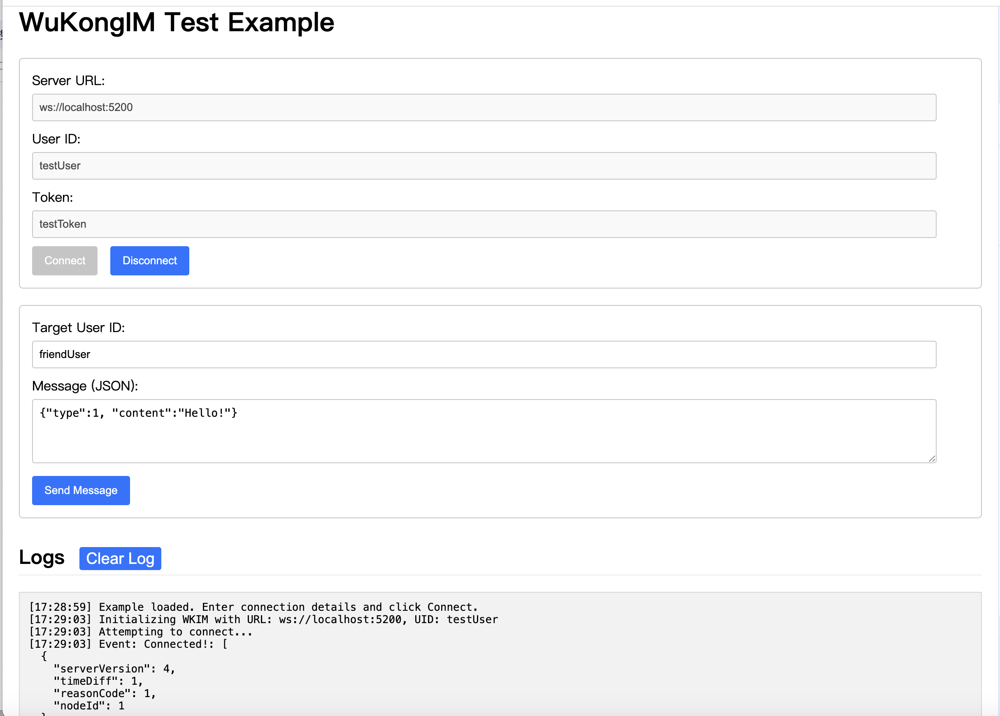

# EasyJSSDK

[中文 README](README_zh.md)

A simple and easy-to-use communication SDK for WuKongIM, based on its JSON-RPC protocol.

## Installation

```bash
npm install easyjssdk
```

## Platform Support

| Platform | Status | Notes |
|----------|--------|-------|
| Browser | ✅ | Native WebSocket |
| Node.js | ✅ | Via `ws` (auto-installed as optional dependency) |
| WeChat Mini Program | ✅ | Uses `wx.connectSocket` |
| Alipay Mini Program | ✅ | Uses `my.connectSocket` |
| UniApp | ✅ | Uses `uni.connectSocket` |

### WeChat Mini Program

The SDK is fully compatible with WeChat Mini Program npm build:

1. Install the package in your mini program project:
   ```bash
   npm install easyjssdk
   ```
2. In WeChat DevTools, go to **Tools → Build npm**
3. Import and use:
   ```javascript
   const { WKIM, WKIMChannelType, WKIMEvent } = require('easyjssdk');
   ```

The `miniprogram` field in `package.json` points to the CJS build, so the mini program build tool can locate the entry correctly. The `ws` dependency is optional and will not be bundled.

## Usage

```typescript
import { WKIM, WKIMChannelType, WKIMEvent } from 'easyjssdk';

// 1. Initialization
const im = WKIM.init("ws://your-wukongim-server.com:5200", {
    uid: "your_user_id",        // Your user ID
    token: "your_auth_token"    // Your authentication token
    // deviceId: "optional_device_id", // Optional device ID
    // deviceFlag: 2 // Optional device flag (1:APP, 2:WEB, default is 2)
});

// 2. Receive messages
im.on(WKIMEvent.Message, (message) => {
    console.log("Received message:", message);
    // Process received message (message.payload, message.fromUid, etc.)
});

// 2.1 Receive custom event notifications
im.on(WKIMEvent.CustomEvent, (event) => {
    console.log("Received event:", event);
    // Handle custom events from server
    // event = { id, type, timestamp, data }
});

// For more events, see:
// https://github.com/WuKongIM/EasyJSSDK/blob/main/example/app.js#L132

// 3. Connect to the server
await im.connect()

// 4. Example: Send a message after successful connection
const targetChannelID = "friend_user_id"; // Target user ID
const messagePayload = { type: 1, content: "Hello from EasyJSSDK!" };
const sendResult = await im.send(targetChannelID, WKIMChannelType.Person, messagePayload);
// sendResult.reasonCode
```

## Features

- **WebSocket Communication** - Real-time bidirectional communication with WuKongIM server
- **Message Sending & Receiving** - Send and receive messages with automatic acknowledgment
- **Event Protocol** - Receive custom event notifications from the server
- **Auto Reconnection** - Automatic reconnection with exponential backoff
- **TypeScript Support** - Full TypeScript type definitions included
- **Multi-Platform** - Browser, Node.js, WeChat / Alipay Mini Program, UniApp
- **Dual Module Format** - Ships both ESM and CommonJS builds
- **Singleton Mode** - Optional singleton pattern for global instance management

## Module Formats

The package ships dual builds:

- **ESM** (`dist/esm/`) — for modern bundlers and `import` syntax
- **CJS** (`dist/cjs/`) — for `require()`, Node.js, and mini program environments

The `exports` field in `package.json` handles automatic resolution:

```jsonc
// package.json (excerpt)
{
  "main": "dist/cjs/index.js",       // CJS entry
  "module": "dist/esm/index.js",     // ESM entry
  "types": "dist/esm/index.d.ts",    // TypeScript types
  "miniprogram": "dist/cjs"          // WeChat Mini Program entry
}
```

## Event Protocol

The SDK supports the Event Protocol, allowing you to receive custom event notifications from the server:

```javascript
// Listen for custom events
im.on(WKIMEvent.CustomEvent, (event) => {
    console.log('Event Type:', event.type);
    console.log('Event Data:', event.data);

    // Handle different event types
    switch (event.type) {
        case 'user.status.changed':
            updateUserStatus(event.data);
            break;
        case 'system.announcement':
            showAnnouncement(event.data);
            break;
    }
});
```

**Event Structure:**
- `id` - Unique event identifier
- `type` - Event type (e.g., "user.status.changed")
- `timestamp` - Event timestamp in milliseconds
- `data` - Event payload (automatically parsed from JSON)

See also:
- [Event Protocol Quick Start](./docs/EVENT_PROTOCOL_QUICKSTART.md)
- [Complete Event Protocol Documentation](./docs/EVENT_PROTOCOL.md)
- [Event Protocol Example](./example/event-example.js)
- [Interactive Event Test Page](./example/event-test.html)

## Example



## Development

1. Clone the repository.
2. Run `npm install`.
3. Run `npm run build` to compile TypeScript (outputs both ESM and CJS).
4. Run `npm test` to run the test suite.

## Running the Example

This repository includes a simple HTML/JS example to test the SDK.

1.  **Build the SDK:**
    ```bash
    npm run build
    ```
2.  **Start a local server:**
    ```bash
    # npm install -g http-server
    http-server .
    ```
3.  **Open the example:** Navigate to `http://localhost:8080/example/`
4.  **Test:** Enter your WuKongIM server details (URL, UID, Token) and use the buttons to connect, disconnect, and send messages.
